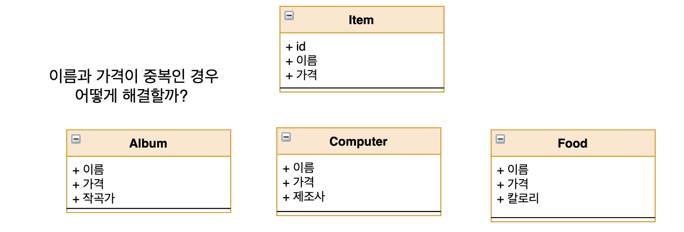
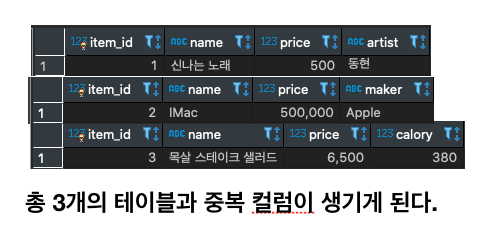

이번 시간에는 JPA 맵핑 방법을 좀 더 깊숙하게 들어가 보겠습니다.

## 1. 상속 관계 맵핑

JPA는 데이터베이스를 객체로 다루기 위해서 만들어 졌습니다. 객체의 장점 중 하나는 상속을 통해 중복코드를 줄일 수 있다는 점이 있지만, 데이터베이스에서는 상속이라는 개념이 없습니다. 

그럼 다음과 같은 중복이 있을 때는 어떻게 해야 할까요?

> 이름,가격 필드가 중복인 경우




### 1.1. 조인 전략

조인 전략은 엔티티를 모두 각각의 테이블로 만들고, 자식 테이블이 부모 테이블의 기본 키를 받아서, 기본 키 + 외래 키 로 사용하는 전략입니다. 따라서 조회를 할 때 조인을 자주 사용 합니다. 여기서 중요한 점은 자식 테이블을 구분하기 위한 컬럼을 부모 테이블에 지정해줘야 합니다. 

#### 조인 전략 Entity 맵핑

```java
@Entity
@Inheritance(strategy = InheritanceType.JOINED)
@DiscriminatorColumn(name = "DTYPE")
public abstract class Item {

    @Id @GeneratedValue
    @Column(name = "ITEM_ID")
    private Long id;

    protected String name;
    protected int price;
}


@Entity
@DiscriminatorValue("A")
class Album extends Item {

    private String artist;

    public Album(String name, int price, String artist) {
        this.name = name;
        this.price = price;
        this.artist = artist;
    }
}

@Entity
@DiscriminatorValue("C")
class Computer extends Item {

    private String maker;

    public Computer(String name, int price, String maker) {
        this.name = name;
        this.price = price;
        this.maker = maker;
    }
}
@Entity
@DiscriminatorValue("F")
class Food extends Item {

    private int calory;

    public Food(String name, int price, int calory) {
        this.name = name;
        this.price = price;
        this.calory = calory;
    }
}
```

- @Inheritance(strategy = InheritanceType.JOINED) : 상속 맵핑은 부모 클래스에 @Inheritance를 사용하며, 여기서는 조인 전략을 사용했으므로 InheritanceType.JOINED를 사용했습니다.
- @DiscriminatorColumn(name = "DTYPE") : 부모 클래스에 구분 컬럼을 만듭니다. 이 컬럼으로 자식 테이블을 구분할 수 있습니다. 기본 값은 DTYPE 입니다.
  @DiscriminatorValue("M") : 엔티티를 저장할 때 구분 컬럼으로 입력 될 값을 지정합니다. "M" 으로 지정해줬다면, 부모 테이블에는 DTYPE 값이 "M" 으로 저장 됩니다.

#### 테스트 해보기

~~제가쓰는 컴퓨터와, 자주 즐겨먹는 샐러드를 넣어보았습니다.ㅋㅋ~~

```java
@Test
public void test() {
  Album album = new Album("신나는 노래",500,"동현");
  Computer computer = new Computer("IMac",500000,"Apple");
  Food food = new Food("목살 스테이크 샐러드" , 6500,380);

  em.persist(album);
  em.persist(computer);
  em.persist(food);
}
```

#### 결과


### 조인테이블의 장점

- 테이블이 정규화됩니다.
- 외래 키 참조 무결성 제약조건을 활용할 수 있습니다.
- 저장공간을 효율적으로 사용합니다.

### 조인테이블의 단점

- 조회할 때 조인이 많이 사용되므로 성능이 저하될 수 있습니다.
- 조회 쿼리가 복잡합니다.

#### **앨범 1개를 조회하는 SELECT 쿼리**

```sql
select 
	album0_.item_id as item_id2_4_0_,
  album0_1_.name as name3_4_0_,
  album0_1_.price as price4_4_0_,
  album0_.artist as artist1_0_0_ 
from 
		album album0_ inner join item album0_1_ on album0_.item_id=album0_1_.item_id 
where 
		album0_.item_id=?
```

- 데이터를 등록할 때 INSERT가 두 번 실행 됩니다.

#### Hibernate의 로그

```java 
Hibernate: insert into item (name, price, dtype, item_id) values (?, ?, 'A', ?)
Hibernate: insert into album (artist, item_id) values (?, ?)
Hibernate: insert into item (name, price, dtype, item_id) values (?, ?, 'C', ?)
Hibernate: insert into computer (maker, item_id) values (?, ?)
Hibernate: insert into item (name, price, dtype, item_id) values (?, ?, 'F', ?)
Hibernate: insert into food (calory, item_id) values (?, ?)
```

3개의 Entity를 넣었지만 총 6개의 Insert 문이 실행되었습니다.


### 1.2 단일 테이블 전략

단일 테이블은 말 그대로 테이블을 하나만 사용합니다. 그리고 구분 컬럼으로 자식 데이터가 저장되었는지 구분 합니다. 조회 할 때 조인을 사용하지 않으므로 일반적으로 가장 빠릅니다.

```java
@Entity
@Inheritance(strategy = InheritanceType.SINGLE_TABLE)
@DiscriminatorColumn(name = "DTYPE")
public abstract class Item {

    @Id @GeneratedValue
    @Column(name = "ITEM_ID")
    private Long id;

    protected String name;
    protected int price;
}


@Entity
@DiscriminatorValue("A")
class Album extends Item {

    private String artist;

    public Album(String name, int price, String artist) {
        this.name = name;
        this.price = price;
        this.artist = artist;
    }
}

@Entity
@DiscriminatorValue("C")
class Computer extends Item {

    private String maker;

    public Computer(String name, int price, String maker) {
        this.name = name;
        this.price = price;
        this.maker = maker;
    }
}
@Entity
@DiscriminatorValue("F")
class Food extends Item {

    private int calory;

    public Food(String name, int price, int calory) {
        this.name = name;
        this.price = price;
        this.calory = calory;
    }
}
```

Item Entity의 @Inheritance의 strategy를 **InheritanceType.SINGLE_TABLE** 로만 변경해주시면 됩니다.

변경 후 똑같이 3개의 데이터를 넣게 되면, Item 테이블은 다음과 같은 상태가 됩니다.

> 단일 테이블 전략을 사용해서 데이터 3개를 넣은 경우


#### 단일 테이블의 장점

- 조인이 필요 없으므로 조회 성능이 빠릅니다.
- 조회 쿼리가 단순합니다.

```sql
select 
	album0_.item_id as item_id2_1_0_,
  album0_.name as name3_1_0_,
  album0_.price as price4_1_0_,
  album0_.artist as artist5_1_0_ 
from item album0_ 
	where 
album0_.item_id=? and album0_.dtype='A'
```

#### 단일 테이블의 단점

- 자식 엔티티가 맵핑한 컬럼은 모두 null이 허용되야 합니다.
- 단일 테이블로 모든 것을 저장하므로 테이블이 커질 수 있어, 상황에 따라서는 조회 성능이 오히려 느려질 수 있습니다.

### 1.3. 구현 클래스마다 테이블 전략

이 전략은 Item의 컬럼들을 자식 테이블마다 컬럼을 추가하는 방법 입니다.

```java
@Entity
@Inheritance(strategy = InheritanceType.TABLE_PER_CLASS)
public abstract class Item {

    @Id @GeneratedValue
    @Column(name = "ITEM_ID")
    private Long id;

    protected String name;
    protected int price;
}


@Entity
@NoArgsConstructor
class Album extends Item { ... }

@Entity
class Computer extends Item { ... }
@Entity
class Food extends Item { ... }
```



### 장점

- 서브 타입을 구분해서 처리할 때 효과적입니다.
- not null 제약 조건을 사용할 수 있습니다.

### 단점 

- 여러 자식 테이블을 함께 조회할 때 성능이 느립니다.(SQL에 UNION을 사용해야 함)
- 자식 테이블을 통합해서 쿼리하기 어렵습니다.

#### **이 전략은 추천하지 않는 전략 입니다.**


## 2.@MappedSuperclass

지금까지는 부모 클래스와 자식 클래스를 모두 테이블에 매핑했습니다. 부모 클래스는 테이블과 매핑하지 않고, 부모 클래스를 상속 받는 자식 클래스에게 매핑 정보만 제공하고 싶으면 **<u>@MappedSuperclass</u>**를 사용하면 됩니다.

회원가입시, 회원가입 날짜를 나타내는 필드인 createdTime이나, 게시글을 작성할 때 작성일을 나타내는 필드인 createdTime 등 공통 속성을 부모에게 물려받아 사용할 수 있습니다.

```java
@MappedSuperclass
public class BaseAuditingEntity {
	private LocalDateTime createdTime;
}
```

