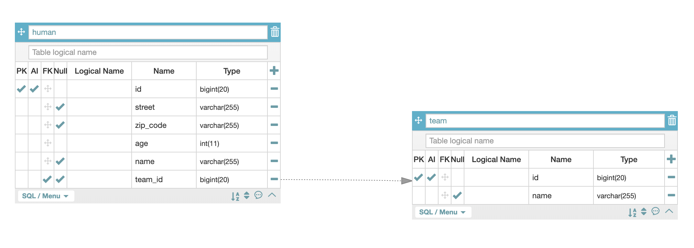
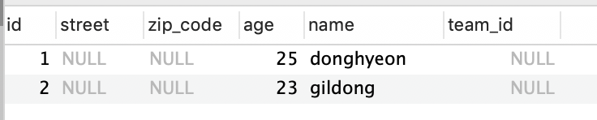
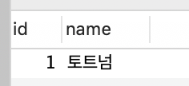

# JPA 연관관계 맵핑(작성중)

JPA 연관관계 맵핑에서, JPA는 서로다른 테이블을 참조할 때 방향이라는 것이 존재합니다. 


## 예제 엔티티

사람인 Human 클래스와 사람이 속할 수 있는 팀인 Team 클래스가 있습니다.

한 팀에는 많은 사람이 속할 수 있습니다. 

사람과 팀의 관계는 **N : 1** 관계 즉 다대일 관계입니다.(사람 관점에서)

**Human**

```java
@Entity
public class Human {

    @Id
    @GeneratedValue(strategy = GenerationType.IDENTITY)
    private Long id;

    private String name;

    private int age;

    @Embedded
    private Address address;
 }
```

**Team**

```java
@Entity
public class Team {

    @Id
    @GeneratedValue(strategy = GenerationType.IDENTITY)
    private Long id;

    private String name;
}
```


## 단방향

실제 데이터베이스에서는 방향이라는 개념이 존재하지 않습니다. JPA에서만 있는 단어입니다.

Human객체에서 Team을 조회 할수는 있지만, 반대로 Team이 Human을 조회를 하지 못하는 관계를 단방향 관계라고 부릅니다.

```java
@Entity
public class Human {

    @Id
    @GeneratedValue(strategy = GenerationType.IDENTITY)
    private Long id;

    private String name;

    private int age;

    @Embedded
    private Address address;
  
    @ManyToOne
    @JoinColumn(name = "team_id")
    Team team;
 }
```

Human 입장에서는 Human 여러 명이 하나의 Team에 붙게 되므로 Human 입장에서보면 @ManyToOne이므로 어노테이션을 붙여주면 됩니다.

@JoinColumn의 역할은 fk로 team의 어떤 필드를 참조할 지 정합니다.  이 값으로 Human과 Team이 조인이 됩니다.

**ERD**




## 양방향

양방향은 단방향과 다르게, Team객체에서도 Human 들을 조회할 수 있습니다.

```java
@Entity
public class Team {

    @Id
    @GeneratedValue(strategy = GenerationType.IDENTITY)
    private Long id;

    private String name;

    @OneToMany(mappedBy = "team")
		List<Human> humans = new ArrayList<>();
}
```

Team 입장에서는 Human과 **1:N** 관계이므로 @OneToMany 어노테이션을 적어주면 됩니다.

### 연관관계의 주인

@OneToMAny는 이해가 한 번에 되지만, mappedBy속성은 왜 필요할까요?

실제로는 객체에는 양방향 연관관계라는 것은 없습니다. 서로 다른 단방향 연관관계 2개를 로직으로 잘 묶어서 양방향으로 보이게 할 뿐입니다.

반면에 데이터베이스 테이블은 외래 키 하나로 양쪽이 서로 조인할 수 있습니다.

그럼 왜 mappedBy 속성이 필요할까요?

양방향 연관관계는 단방향 연관관계가 X 2개 있는 것과 동일하기 때문에 이 연관관계 외래키를 관리하는 포인트가 2군데로 늘어 나게 됩니다. 

그래서 한쪽에 두고 사용해야 하기 때문에 **두 연관관계 중 하나를 정해서 테이블의 외래키를 관리**해야 하는데, 이것을 연관관계 주인이라고 합니다.

연관관계 **주인만이 데이터베이스 연관관계와 매핑되고, 외래키를 관리(등록,수정,삭제**)할 수 있습니다. 반면에 주인이 아닌 쪽은 **읽기**만 할 수 있습니다.

- 연관관계 주인은 mappedBy 속성을 사용하지 않는다.
- 주인이 아니면 mappedBy 속성을 사용해서 속성의 값으로 연관관계의 주인을 지정해야한다.

### 연관관계 주인 선택

연관관계의 주인을 정한다는 것은 사실 외래 키 관리자를 선택하는 것입니다.

#### 누가 연관관계 주인이 될래?

지금처럼 휴먼 엔티티에 있는 Human.team을 주인으로  선택하면 자기 테이블에 있는 외래 키를 관리하면 됩니다. 하지만 팀 엔티티에 있는 team.humans를 주인으로 선택하면 물리적으로 전혀 다른 테이블의 외래키를 관리해야 합니다. 왜냐하면 이 경우 Team.humans가 있는 Team 엔티티는 Team 테이블에 매핑되어 있는데, 관리해야 할 외래 키는 Human 테이블에 있기 때문입니다.

지금처럼 **연관관계의 주인은 외래 키가 있는 곳**으로 정합니다. 여기서는 휴먼 테이블이 외래 키를 가지고 있으므로 Human.team이 주인이 됩니다. **주인이 아닌 쪽은 mappedBy 속성으로 사용해서 주인이 아님을 설정**합니다. 

mappedby 속성의 값으로 연관관계의 주인인 team을 주면 됩니다. 이 **team은 Human.team 필드** 입니다.

> 데이터베이스 테이블의 다대일, 일대다 관계에서는 항상 다 쪽이 외래 키를 가지기 때문에 @ManyToOne은 항상 연관관계의 주인이기 떄문에 mappedBy 속성이 없습니다.

### 양방향 연관관계 주의점

양방향 연관관계를 설정하고 데이터를 넣을 때 하는 실수는 연관관계의 주인에는 값을 입력하지 않고, 주인이 아닌 곳에만 값을 입력하는 것 입니다.

테스트코드

```java
@Test
public void 저장이안되는_테스트() {

    //사람1
    Human human1 = new Human("donghyeon",25);
    em.persist(human1);
    //사람2
    Human human2 = new Human("gildong",23);
    em.persist(human2);

    Team team1 = new Team("토트넘");
    //주인이 아닌 곳에만 연관관계 설정
    team1.getHumans().add(human1);
    team1.getHumans().add(human2);
    em.persist(team1);
}
```

**데이터베이스 결과**

human 테이블



team 테이블



human테이블의 team_id 값이 null이 들어가는데, 연관관계의 주인이 아닌 Team.humans에만 값을 저장했기 때문입니다. 연관관계의 주인만이 외래 키의 값을 변경할 수 있습니다.

#### POJO 객체를 고려한 양방향 연관관계

그럼 연관관계의 주인인 **Human** 에만 연관관계를 연결해주고 그 반대인 **Team** 에게만 연결해주지 않아도 될까요? **사실 객체 관점에서 보면 양쪽 방향 모두 값을 입력해주는 것이 가장 안전합니다.** 양쪽 방향 모두 값을 입력하지 않으면 JPA를 사용하지 않는 순수한 객체 상태에서 심각한 문제가 발생할 수 있습니다. 

순수한객체 테스트

```java
@Test
public void 순수한객체_양방향_테스트() {
    //팀1
    Team team1 = new Team("토트넘");
    Human human1 = new Human("donghyeon",25);
    Human human2 = new Human("donghyeon",25);

    //연관관계 설정
    human1.setTeam(team1);
    human2.setTeam(team1);

    List<Human> humans = team1.getHumans();

    //테스트가 실패한다
    assertThat(humans.size()).isEqualTo(2);
}
```

결과

```java
expected:<[2]> but was:<[0]>
Expected :2
Actual   :0
```


이런 문제를 해결하기 위해서는 양쪽 다 관계를 설정해야 합니다. human에게 team을 설정했으면, 그 반대인 team도 human을 설정해줘야 합니다. 

```java
@Test
public void 순수한객체_양방향_테스트() {
    //팀1
    Team team1 = new Team("토트넘");
    Human human1 = new Human("donghyeon",25);
    Human human2 = new Human("donghyeon",25);

    //연관관계 설정
    human1.setTeam(team1);
    team1.getHumans().add(human1);

    human2.setTeam(team1);
    team1.getHumans().add(human2);

    List<Human> humans = team1.getHumans();

    assertThat(humans.size()).isEqualTo(2);
}
```

#### 더 편한 방법은 없을까?

이렇게 양방향 관계를 맺을 때 양쪽 모두 관계를 맺어주는 일은 귀찮고 빼먹을 수도 있으며, 코드량이 늘어나게 됩니다. 이 관계를 맺어주는 메소드를 연관관계의 주인인 Human에서 관리하는 것이 더 좋습니다.

```java
public class Human {
		...
      
    @ManyToOne
    @JoinColumn(name = "team_id")
    Team team;

    public void setTeam(Team team) {
        this.team = team;
        team.getHumans().add(this);
    }
}
```

이렇게 코드를 리팩토링하면 됩니다.

## @OnetoOne


## @OneToMany


## @ManyToOne


## @ManyToMany


