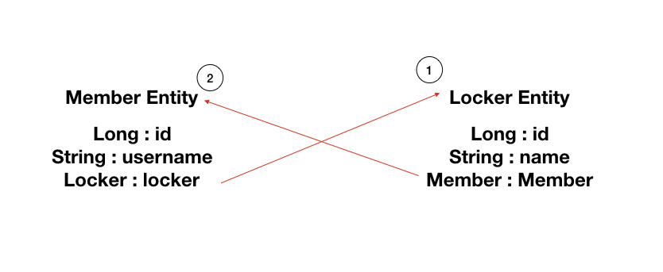

# 

**Locker Entity**

**Member Entity**

## StackOverFlow 오류

### 일어나는 이유 

Lombok의 `@ToString` 어노테이션을 Entity 클래스에 붙여주면 양방향 관계를 맺으면 StackOverFlow가 나타납니다.

이 현상이 일어나는 이유는 서로 대상객체를 조회하기 때문입니다.

이걸 방지하기 위해서 `@ToString` 어노테이션을 제거하고 재정의하는 방법을 사용해야 합니다.

1번과 2번이 무한으로 호출이 되서 StackOverFlow가 남.

